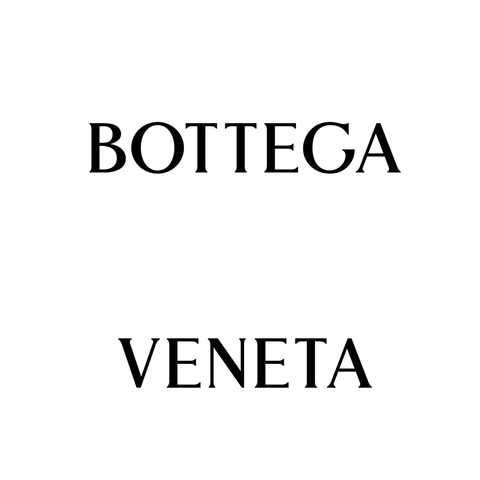

<p align="center" dir="auto">

</p>

# Vue 3 Page Builder — Free, Self-Hosted, Integration-First

**The Vue page builder for ecommerce admin panels, multi-tenant SaaS, and API-backed CMS dashboards.** Embed a visual editor in your product, connect your own media library and product catalog, and save portable HTML to your backend.

- [Vue 3 Page Builder — Free, Self-Hosted, Integration-First](#vue-3-page-builder--free-self-hosted-integration-first)
  - [Demo](#demo)
  - [Guide \& Documentation](#guide--documentation)
  - [Built for Ecommerce Admin \& Multi-Tenant SaaS](#built-for-ecommerce-admin--multi-tenant-saas)
  - [Ecommerce Product Sections](#ecommerce-product-sections)
  - [Who This Is For](#who-this-is-for)
  - [Backend and CMS Integration](#backend-and-cms-integration)
  - [Why Choose This Vue Page Builder](#why-choose-this-vue-page-builder)
  - [Overview](#overview)
  - [Get Started in Minutes](#get-started-in-minutes)
  - [About](#about)
  - [Real-World Application Example](#real-world-application-example)
  - [Reviews, Ratings, and User Testimonials](#reviews-ratings-and-user-testimonials)
  - [Features](#features)
  - [How the Page Builder Works](#how-the-page-builder-works)
  - [Page Builder Architecture](#page-builder-architecture)
  - [Contributing](#contributing)
  - [Security Vulnerabilities](#security-vulnerabilities)
  - [Get in Touch for Customization or Any Questions](#get-in-touch-for-customization-or-any-questions)
  - [Report Issues or Request Features](#report-issues-or-request-features)
  - [Feedback](#feedback)
  - [Support the Project](#support-the-project)
  - [License](#license)

## Demo

Free **Vue 3 page builder** with drag-and-drop editing for ecommerce admin, SaaS dashboards, and CMS workflows. Try the live demo for real-time visual updates, product sections, and content management.

Try the live demo to explore real-time visual updates and smooth content management.
<br>
[Play with the Page Builder](https://mybuilder.dev)

Create and enhance digital experiences with Vue on any backend.
Experience the power and simplicity of the Vue Website Page Builder in action, with a live SEO analyzer for content optimization.


## Guide & Documentation

A Page Builder designed for growth. Build your website pages with ready-made components that are fully customizable and always responsive, designed to fit every need. A powerful Page Builder for growing merchants, brands, and agencies. And it is totally free.

Find everything you need to get started, configure, and master the Vue Website Page Builder.
This section covers installation, requirements, quick start, advanced usage, and integration tips—so you can build and launch pages with confidence.

[Open Guides & Docs](https://myissue-studio.github.io/vue-website-page-builder/)

Key integration guides:

- [Display Products (Ecommerce)](https://myissue-studio.github.io/vue-website-page-builder/display-products) — connect your catalog and insert product grids
- [Custom Media Library](https://myissue-studio.github.io/vue-website-page-builder/custom-media-library) — wire your uploads, CDN, or DAM
- [TypeScript Support](https://myissue-studio.github.io/vue-website-page-builder/typescript-support) — typed config, products, and services

## Built for Ecommerce Admin & Multi-Tenant SaaS

Most page builders are tied to one CMS, one storefront, or one cloud platform. This project is built for teams that already have a **Vue admin**, a **REST or GraphQL API**, and a **database** — and need a visual editor inside that product.

**Best fit if you are building:**

- **Ecommerce admin** — merchants edit landing pages, collection pages, and promotional blocks while your platform owns catalog, cart, and checkout
- **Multi-tenant SaaS** — each customer gets branded pages; your app handles auth, billing, and tenancy; the builder outputs HTML you store per tenant
- **Headless CMS / marketplace admin** — editors compose pages from blocks; your backend persists full HTML and serves it on the public site
- **Agency & startup dashboards** — free, MIT-licensed, self-hosted; no vendor lock-in on hosting or storage

**Why Vue teams choose this over generic builders:**

- **Vue-native** — serious Vue 3 component with fewer integration compromises than dropping a React-only or iframe-based editor into a Nuxt or Laravel + Inertia app
- **Integration-first** — inject `:CustomMediaLibraryComponent` and `:DisplayProducts` instead of being locked to one asset provider or product database
- **Your backend stays in charge** — authentication, permissions, publishing, CDN, and checkout remain on your stack; the builder focuses on visual editing and portable HTML output

[Live demo](https://mybuilder.dev) · [Display Products guide](https://myissue-studio.github.io/vue-website-page-builder/display-products)

## Ecommerce Product Sections

Add real product catalog blocks to any page — without WooCommerce shortcodes or rigid storefront widgets.

Pass `:DisplayProducts` with your own product picker component. The builder opens it in the **Products** modal; when the editor confirms, you call `insertProducts()` and the canvas gets a responsive product grid (1, 2, 3, 4, or 6 columns).

**What you get out of the box:**

- **Your catalog UI** — search, categories, API pagination, Shopify/WooCommerce/custom ERP feeds (you implement the picker; we provide the hook)
- **Built-in grid layouts** — `grid-1` through `grid-6`, mobile column options, card styles (clean, bordered, shadow, elevated), rounded product images
- **Toolbar editing after insert** — change grid, mobile layout, and card style from the floating editor without re-inserting products
- **Portable HTML** — sections include `data-pbx-product-section` and `data-pbx-product-id` for hydration or tracking on your storefront

```vue
<script setup>
import PageBuilder from '@myissue/vue-website-page-builder'
import YourDisplayProducts from './YourDisplayProducts.vue'
</script>

<template>
  <PageBuilder :DisplayProducts="YourDisplayProducts" />
</template>
```

Copy the reference picker from `src/tests/TestComponents/DemoDisplayProductsTest.vue` and swap static JSON for your API. Full walkthrough: [Display Products documentation](https://myissue-studio.github.io/vue-website-page-builder/display-products).

The package does **not** include cart, checkout, or inventory — by design. You keep your ecommerce stack; the builder handles layout and visual editing.

## Who This Is For

| Use case | Why this builder |
|----------|------------------|
| **Ecommerce admin panels** | Merchants design pages; you connect `:DisplayProducts` to your catalog API |
| **Multi-tenant SaaS** | Per-tenant pages, your auth and storage; HTML output works on any frontend |
| **Laravel / Nuxt / Vue admin** | Drop-in `PageBuilder` component + `getPageBuilder()` service |
| **Headless CMS (Strapi, Directus, custom)** | Save `getSavedPageHtml()` to your content API; reload with `parsePageBuilderHTML()` |
| **Marketplaces & listings** | Job boards, directories, blogs — same editor, your data layer |
| **Agencies & startups** | Free, MIT, self-hosted — low friction to embed and ship |

Works with Laravel, Rails, Django, Express, Nuxt, Inertia, and any API that can store and return an HTML string.

## Backend and CMS Integration

This Vue page builder is designed for real CMS, SaaS, marketplace, blog, job board, listing, and ecommerce admin workflows. The editor uses browser local storage for draft recovery and autosave, but production persistence belongs to your backend.

Recommended production flow:

1. Start the builder with your config:

```ts
await pageBuilderService.startBuilder(configPageBuilder)
```

2. Save the full page HTML to your backend:

```ts
const content = pageBuilderService.getSavedPageHtml()
await api.updatePost(post.id, { content })
```

3. Edit existing backend content later:

```ts
const { components, pageSettings } = pageBuilderService.parsePageBuilderHTML(post.content)

await pageBuilderService.startBuilder(
  {
    ...configPageBuilder,
    updateOrCreate: {
      formType: 'update',
      formName: 'article',
    },
    pageSettings,
  },
  components,
)
```

Store the complete HTML string, including the outer `#pagebuilder` wrapper:

```html
<div id="pagebuilder" class="pbx-bg-red-500" style="letter-spacing: 2px;">
  <section data-component-title="Hero">...</section>
  <section data-component-title="Content">...</section>
</div>
```

The wrapper stores global page styles. The sections store editable components. This makes the builder easy to use with Laravel, Rails, Django, Express, Nuxt, headless CMS platforms, custom admin panels, and any API-backed product.

## Why Choose This Vue Page Builder

Many page builders are heavy, opinionated, or tied to one CMS. This project focuses on a different use case: a lightweight Vue 3 page builder that you can embed inside your own product, connect to your own backend, and style for your own brand.

- **Backend-first persistence**: local storage is used for draft recovery, while your database stores the published full HTML.
- **Portable HTML output**: saved content is standard HTML with a `#pagebuilder` wrapper and direct `<section>` children.
- **Works with existing systems**: integrate with custom CMS dashboards, SaaS admin panels, marketplaces, job boards, blogs, and ecommerce content tools.
- **Vue-native integration**: use the `PageBuilder` component and `getPageBuilder()` service directly in Vue or Nuxt projects.
- **Bring your own media library**: inject your own media picker, storage URLs, and upload flow instead of being locked into one asset provider.
- **Bring your own product catalog**: inject `:DisplayProducts` to browse real SKUs from your API and insert responsive product grids — ideal for ecommerce admin and storefront content teams.
- **Edit product sections on canvas**: after insert, change grid layout, mobile columns, card style, and rounded images from the toolbar without re-opening the catalog modal.
- **Global page styles included**: `pageSettings` can be saved and restored with the page, so editing existing posts keeps fonts, colors, backgrounds, and spacing.
- **No Tailwind setup required**: the package ships the needed prefixed styles and avoids class conflicts with your app.
- **Open and customizable**: MIT licensed, component-driven, and practical for teams that need control over the editing experience.

This is a general-purpose builder by design. It does not try to replace your backend, authentication, permissions, CDN, or publishing workflow. It gives your product a visual editor while letting your platform stay in charge of data, scale, security, and deployment.

## Overview

If you're a Vue 3 developer, this builder feels right at home. It installs quickly via npm and supports full customization through props and configuration objects. You can even set specific user settings like image, name, theme, language, company logo, and autosave preferences, making it a personalized experience for every user.

A lightweight and minimalist Page Builder with an elegant and intuitive design, focused on simplicity and speed.

Build responsive pages like listings, jobs, or blog posts and manage content easily.


## Get Started in Minutes

Easy setup and instant productivity.
Follow the [Quick Start](#quick-start) guide to begin building with just a few simple steps.

---

## About

A Page Builder designed for growth. Build your website pages with ready-made components that are fully customizable and always responsive, designed to fit every need. A powerful Page Builder for growing merchants, brands, and agencies. And it is totally free.


## Real-World Application Example

From solo freelancers to fast-growing startups and established enterprises, the Page Builder is trusted by teams everywhere. With its intuitive click-and-drop editor, real-time visual editing, and a rich library of reusable components, you can turn ideas into polished pages in minutes. Built for merchants, brands, and agencies, it empowers anyone to create high-impact content.

Discover how the Vue Website Page Builder is empowering businesses to create dynamic and responsive web pages. Used by teams at myself.ae, Zara, H&M, Chanel, BOSS, DKNY, Aldo, Bershka, Furla, Pandora, The New York Times, and Pentagram — the builder powers engaging, user-friendly pages across fashion, retail, media, and design.

<br>

<h3 align="center">Teams from top companies building using this page builder</h3>

<p align="center">
  
  &nbsp;&nbsp;
  
  &nbsp;&nbsp;
  
  &nbsp;&nbsp;
  
  <br><br>
  
  &nbsp;&nbsp;
  
  &nbsp;&nbsp;
  
  &nbsp;&nbsp;
  
  <br><br>
  
  &nbsp;&nbsp;
  
  &nbsp;&nbsp;
  
  &nbsp;&nbsp;
  
</p>

<br>

## Reviews, Ratings, and User Testimonials

Here’s what users are saying about the Vue Website Page Builder:

⭐⭐⭐⭐⭐ "Game-Changer for Our Business"

_"The Vue Website Page Builder has completely transformed how we create and manage our website pages. The click-and-drop functionality is intuitive, and the real-time editing saves us so much time. Highly recommended!"_
— **Sarah L., Marketing Manager**

---

⭐⭐⭐⭐⭐ "Perfect for Agencies"

_"As an agency, we needed a tool that was flexible, fast, and easy to use for our clients. This builder ticks all the boxes. The reusable components and responsive design features are a huge plus!"_
— **James R., Founder of CreativeWorks**

---

⭐⭐⭐⭐ "Impressive Features and Support"

_"The builder is packed with features, and the support team is incredibly responsive."_
— **Emily T., Freelance Web Designer**

---

⭐⭐⭐⭐⭐ "A Must-Have for Blogs"

_"We use the builder for our blog. The ability to customize every detail while keeping the pages responsive is amazing. Our sales have increased since switching to this tool!"_
— **Ahmed K., Owner of Trendy**

---

⭐⭐⭐⭐⭐ "Great for Beginners and Experts Alike"

_"I’m not a developer, but I was able to create a professional-looking page in minutes. The interface is user-friendly, and the results are stunning."_
— **Lisa M., Small Business Owner**

---

Want to share your experience? [Submit your testimonial here](#feedback).

## Features

Includes:

- **Page Builder**: A Click & Drop Page Builder.
- **Customizable Design**: Customize the look to match your brand.

The Page Builder is packed with features:

- **Click & Drop**: Easily rearrange elements on your page.
- **Reordering**: Change the order of your content without hassle.
- **True Visual Editing**: See your changes in real-time as you make them.
- **Media Library**: Inject your own custom media library component (`:CustomMediaLibraryComponent`) — S3, Cloudinary, Unsplash, or internal DAM.
- **Ecommerce Product Sections**: Inject your own product picker (`:DisplayProducts`) — connect Shopify, WooCommerce, Medusa, or custom APIs; built-in grids, card styles, and toolbar layout editing.
- **Advanced Sliders & Carousels**: Build responsive image and content sliders with autoplay, navigation controls, touch support, and full customization options.
- **Draft Recovery & Auto-Save**: Never lose in-progress work—changes are saved locally as a draft while your backend stores published HTML.
- **Unsplash**: Unsplash integration.
- **Responsive Editing**: Ensure your site looks great on all devices.
- **Text Editing**: Edit text content live and in real-time.
- **Font Customization**: Choose the perfect fonts to match your style.
- **SEO Score Checker**: Analyze your content live while editing for SEO optimization, including keyword density, readability, heading structure, and overall score to boost search rankings.
- **Undo & Redo**: Experiment confidently with the ability to revert changes.
- **Global Styles**: Global styles for fonts, designs, and colors.
- **YouTube Videos**: Integrate video content smoothly.
- **Download HTML**: Export the entire page as a standalone HTML file.
- **Global Page Styling**: Instantly define, update, or clear global styles for the main page wrapper at initialization or dynamically at runtime. Gain full control over fonts, colors, backgrounds, and more for a dynamic user experience.
- **Tailwind Support**: Fully compatible with Tailwind CSS (v.3 or v.4) (with automatic class prefixing to avoid conflicts). Tailwind installation is not required for the Page Builder to work.
- **Scoped Styles**: To ensure clean and predictable styling, the builder uses scoped style isolation. There is no risk of style conflicts between the builder and your app.
- **HTML Editor**: Access and edit raw HTML directly for full customization and developer-level control.
- **Tailwind CSS 4**: Optimized for performance and flexibility.

## How the Page Builder Works

The Page Builder is designed to be easy to use and flexible for any web project. Here’s how it works behind the scenes:

- **Configuration First:**
  When you start the builder, you pass in your configuration (such as what type of page you’re building, user info, branding, and any existing content).
  The builder saves this configuration immediately—even if the editing interface `DOM` isn’t loaded yet. This means you can safely set up the builder in advance, and it will be ready as soon as the editor appears on the page.

- **Loading Content:**
  If you have existing content (like a published page), the builder loads it so you can continue editing. If not, you start with a blank page.

- **Editing Experience:**
  As you add, move, or edit components (like text, images, or sections), the builder keeps everything in sync—both in the app’s memory and in your browser’s local storage. This means your work is always saved, even if you close the browser.

**In short:**
The Page Builder handles all the technical details of editing, saving, and loading pages, so your users can focus on creating great content—without worrying about losing their work or dealing with a complicated setup.

## Page Builder Architecture

The Page Builder is designed as a modular, state-driven editor for dynamic page content. Its architecture separates configuration, state management, and `DOM` interaction, ensuring flexibility and maintainability.


## Contributing

1. Fork the repository.
2. Create your feature branch.
3. Make your changes.
4. Build and test locally.
5. Submit a pull request.

## Security Vulnerabilities

If you discover a security vulnerability, please send us a message.

## Get in Touch for Customization or Any Questions

If you have any questions or if you're looking for customization, feel free to connect with our developers.

- [Contact](https://mybuilder.dev)

## Report Issues or Request Features

Encountered a bug, have suggestions, or need a new feature? Create a GitHub issue:

- [Submit an Issue](https://github.com/myissue-studio/vue-website-page-builder/issues)

## Feedback

Feedback, suggestions or any issues you encounter while using this app. Feel free to reach out.

- [Submit your testimonial here](https://github.com/myissue-studio/vue-website-page-builder/issues)

## Support the Project

We would greatly appreciate it if you could star the GitHub repository. Starring the project helps to boost its visibility.

## License

[MIT License](./LICENSE)
